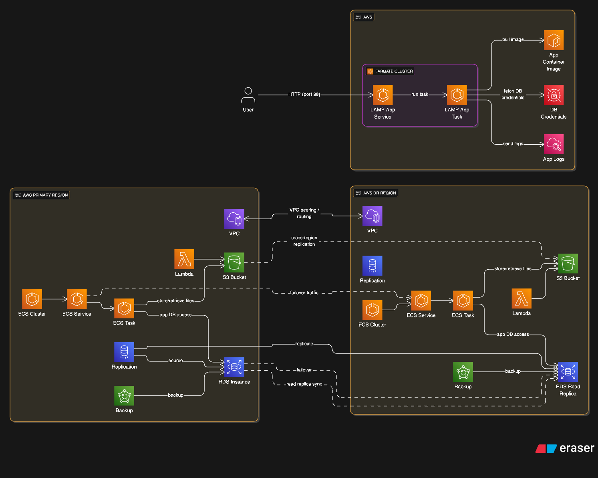
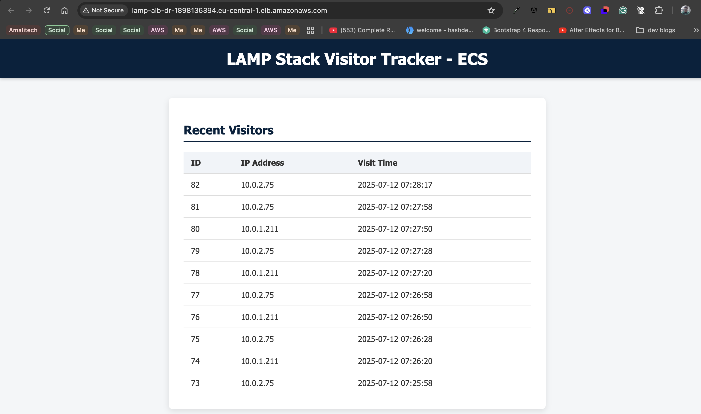

# LAMP Stack Disaster Recovery (DR) on AWS using Terraform

This project implements a fully automated, cost-optimized Disaster Recovery architecture for a containerized LAMP (Linux, Apache, MySQL, PHP) application deployed on Amazon ECS with cross-region RDS replication.

---

## Components

- **Terraform** - Infrastructure as Code (modular)
- **ECS Cluster** with pilot-light DR setup (tasks = 0 by default)
- **Cross-region RDS** read replica (encrypted)
- **Custom KMS key** with multi-region replication
- Security groups, subnet groups, and IAM roles for ECS tasks
- DR failover and failback bash scripts
- **Secrets Manager** integration for database credentials
- **CloudWatch** - Monitoring + replication lag alert
- **GitHub Actions** - CI/CD pipeline
- **Route 53 (Optional)** - DNS failover

---

## Project Structure

```

├── README.md
├── failback.sh
├── failover.sh
├── reset_dr.sh
└── terraform-dr
    ├── failover.log
    ├── main.tf
    ├── modules
    │   ├── alb
    │   │   ├── main.tf
    │   │   ├── outputs.tf
    │   │   ├── terraform.tf
    │   │   └── variables.tf
    │   ├── ecs
    │   │   ├── main.tf
    │   │   ├── outputs.tf
    │   │   ├── terraform.tf
    │   │   └── variables.tf
    │   └── rds
    │       ├── main.tf
    │       ├── outputs.tf
    │       ├── terraform.tf
    │       └── variables.tf
    ├── outputs.tf
    ├── terraform.tfstate
    └── variables.tf
```

---

## Architecture



---

## Deployment Instructions

### 1. Clone & Configure

```bash
git clone https://github.com/Humaidu/terraform-dr.git
cd terraform-dr
```

Edit `variables.tf` or pass variables via CLI or `.tfvars`.

### 2. Initialize Terraform

```bash
terraform init
```

### 3. Plan & Deploy Infrastructure

```bash
terraform plan
terraform apply
```

---

## DR Trigger Steps (Failover)

1. Simulate failure in source region (e.g., scale ECS service to 0)
2. Run the failover script:
```bash
chmod +x failover.sh
./failover.sh
```
This will:
- **Promote** the DR read replica
- **Update** Secrets Manager with new endpoint
- **Register** new ECS task definition
- **Scale** ECS service to 1 in DR

---

## Failback Steps

Once the source region is back online:
```bash
chmod +x failover.sh
./failback.sh
```
This will:
- **Create** a new read replica in primary region
- **Update** secrets and ECS task definition
- **Restore** service to primary

---

## Notes

- This is designed for pilot-light DR strategy.
- Task count in DR remains 0 until failover.
- Secrets Manager must contain `DB_ENDPOINT`, `DB_USERNAME`, `DB_PASSWORD`, `DB_NAME`

---

## KMS Key Consideration

Ensure your source region KMS key is a **multi-region key** and allow `kms:ReplicateKey` in its key policy.

## AWS Secrets Manager

Instead of embedding DB credentials in your container environment, this architecture uses **Secrets Manager** to store:

```json
{
  "DB_ENDPOINT": "your-db-endpoint",
  "DB_USERNAME": "admin",
  "DB_PASSWORD": "strongpassword",
  "DB_NAME": "lampdb"
}
```

The ECS task fetches these at runtime using `secrets` in `container_definitions`.

---

## CloudWatch Monitoring

### ReplicaLag Alarm

A CloudWatch alarm tracks replication lag between your source DB and read replica.

- Metric: `ReplicaLag`
- Threshold: `> 30 seconds`
- Action: Optional SNS topic for alerting

---

## Optional: Route 53 DNS Failover

Set up DNS failover by:

- Creating ALBs in both regions
- Setting Route 53 with **failover routing policy**
- Primary = Prod region, Secondary = DR region

---

## CI/CD (GitHub Actions)

Changes to the task definition or infrastructure can trigger automated deployments using GitHub Actions.

Include a workflow that:
- Registers a new ECS task definition
- Updates ECS service with the new task
- Validates Secrets Manager integration

---

## Cost Optimization

- ECS services in DR use `desired_count = 0`
- T3 burstable instances for RDS
- Cross-region replication only incurs minimal traffic
- Enable lifecycle rules for old S3 or logs

---

## Documentation

- IaC is modular and reusable
- Failover steps are scripted
- CloudWatch & Secrets Manager integrations built-in

---

## Network & Security Configuration (Disaster Recovery - DR Region)

This project deploys the ECS tasks, ALB, and RDS read replica in a **secure private network** with strict access controls.

### Security Groups Setup

| Component     | Allowed Inbound Traffic      | Purpose                                           |
|---------------|------------------------------|---------------------------------------------------|
| **ALB SG**    | Port 80 from `0.0.0.0/0`      | Allow public HTTP traffic to Load Balancer       |
| **ECS Task SG** | Port 80 from ALB SG         | Only accept traffic routed through the ALB       |
| **RDS SG**    | Port 3306 from ECS SG         | Allow MySQL access from ECS only                 |

### Outputs

- ALB DNS name can be found via Terraform output: `terraform output alb_dns_name`

### Architecture Flow

```
User --> ALB (public) --> ECS Task (private) --> RDS Read Replica (private)
```

## Terraform Highlights

- **ALB is public**, ECS and RDS are in **private subnets**
- **NAT Gateway** (via VPC module) allows ECS to pull container images and access Secrets Manager
- All resources are deployed in the DR region (`eu-central-1`) with minimal permissions following least-privilege principles

## Modules

- `modules/vpc` - Sets up VPC, subnets, NAT Gateway, route tables
- `modules/alb` - Provisions ALB and target group for ECS
- `modules/ecs` - ECS Fargate service, task definitions, IAM, log groups
- `modules/rds` - RDS MySQL read replica, subnet group, SG, CloudWatch alarm

---

## Proof Of Concept

This is my ECS App in the DR Region after running the failover script



---
## Take Note

Because of Cost Management, At the moment:
- ECS services scaled to 0
- RDS Replica in DR not promoted
- Run failover script to scale ECS task to desired count and promote RDS to access the ECS App through the load balancer
